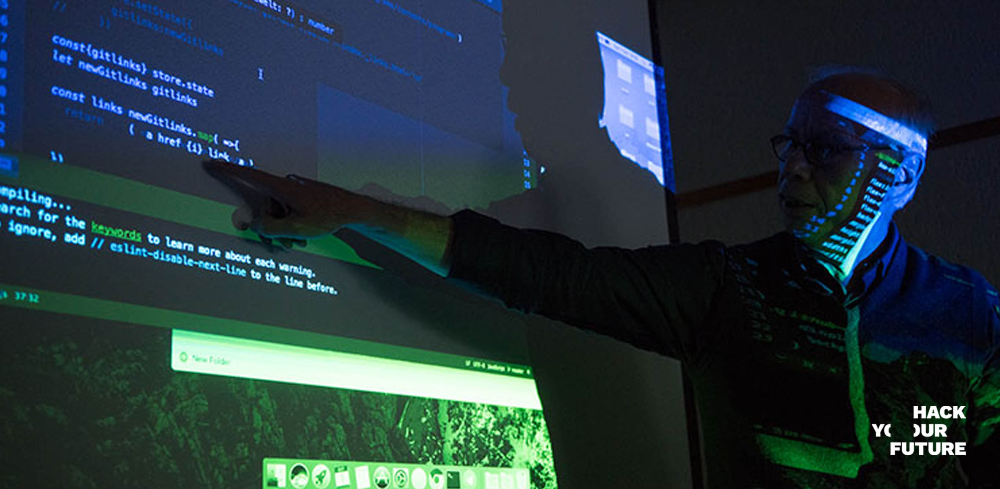

# The technical interview

In technical interviews you will most likely be asked technical questions about programming in general and the type of questions you will receive depend on what role you are applying for (front-end/backend/etc), and whether it’s for an internship or for a junior developer role. 

To prepare for this interview, we strongly recommend you go through [The Most Common Technical Questions for HYF Graduates](/technicalquestions.md) and not only check that you can answer all the theoretical questions but also that you can do some of the challenges in the additional resource.

Make sure you really study these questions. What does this mean? To answer that question you have to know what a technical question is aiming at:

- Can you recognize which concepts are involved?
- Have you ever been exposed to this use case?
- Do you know what the problem statement actually is?

It’s up to you to be able to answer these questions. If you can do that, you’re able to apply your understanding to new problems and show that to the interviewer. If you can’t do that, there’s still work to be done. You have to go back to the study material and practice!

The second thing to practice is your way of answering the questions. The way you answer any question, whether technical or not, is just as important as the content. Here are some tips for how to deliver your answers:

## Don’t be afraid of asking clarifying questions
Sometimes you don’t completely understand the question. This is an opportunity for you to show your curiosity! Ask the interviewer about the context and/or relevant variables.

## Make problems more concrete (write pseudocode)
When presented with a coding problem, it always seems like a big, intimidating challenge. Break it up into smaller pieces! Share your approach of dividing the problem into smaller problems with the interviewer. Or alternatively, write pseudocode and share this with the interviewer.

## Think out loud
When answering technical questions, an interviewer doesn’t just want to know the answer. They want to know how you came to that conclusion. What are the logical steps you’re making? Based on which assumptions are you making those steps? By thinking out loud you are showing why you think something is the case.

## Explain as if the interviewer doesn’t know JavaScript/programming
You don’t know the technical skill of the interviewer. Therefore, it’s safest to assume they don’t know JavaScript. When answering, explain concepts from the ground up and take the interviewer by the hand to help them understand.

## Be honest and open (if you’re stuck or don’t know the answer, etc.)
By being honest and open you show that you’re easy to talk to. It also means you’re trustworthy, as no one knows all the answers. However,  this is not easy: it requires some faith and belief that everything will work out.

## Double check your solutions
When presented with a coding problem, do your best to make it the best you can. Make a plan of action and then execute. Before you submit it, however, always double check your solution: did you make any spelling mistakes? Did you write the code clean? Is the logic sound? If done right, this shows the interviewer that you take your work seriously. 

***Ready to learn more about the technical assignment?*** Then [click here!](/technicalassignment.md)
